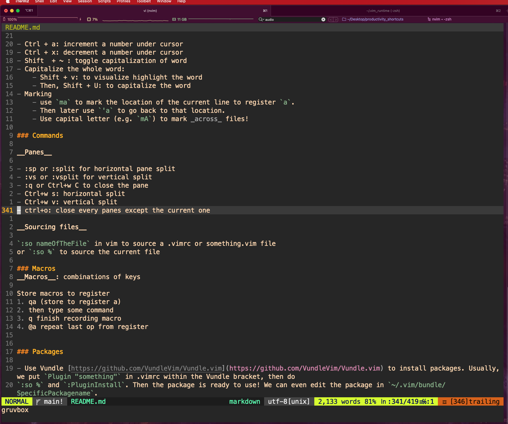

# Productivity shortcuts & settings

## Iterm2

### Shortcuts

- `Command + tab`: open new tab
- `Command + number or Command + ->/<-`: move between tabs
(who needs tmux!!)
- `Command + d`: open split pane horizontal
- `Shift + Command + d`: split pane vertical
- `ctrl + d`: close this iterm pane
- `Shift + arrow key`: move between panes 
(I customized this by going to Preferences/profiles/Keys and add shortcuts for `Previous Pane` and `Next Pane`)
- `Cmd + K`: equivalent to `$ clear` in terminal

### Hotkey Window


To configure ITerm 2 hot key window.

1. Open iTerm2
2. Go to `preference > Keys > Hotkey`
3. "Create a Dedicated HotKey Window"
4. On the Hotkey, choose the shortcut by holding Ctrl and h. Then click ok to create
5. `Ctrl + h` to open use hotkey window
6. Set background image randomly. Download file from [https://github.com/jamsyoung/iterm2-random-background](https://github.com/jamsyoung/iterm2-random-background) to `~/Downloads`. Then go to iterm2 `Preferences/profiles/general` and 
add the execution code `osascript ~/Downloads/iterm2-random-background.scpt` (I think `osa` means os Apple?) in "Send text at start".

### Cool things to configure


1. Configure iterms to either be transparent or use background image. (Preferences>profile>(select the correct profile)>windows)
2. Use the ubuntu colors! (Preferences>profile>colors)
3. Use `ZSH_THEME="powerlevel10k/powerlevel10k"` in the `.zshrc` file. May have to install `oh-my-zsh`.

### Remap keys

[https://apple.stackexchange.com/questions/89981/remapping-keys-in-iterm2](https://apple.stackexchange.com/questions/89981/remapping-keys-in-iterm2)
In iterm2, go to `Preferences/keys/keybindings` then we can add custom key binding.
For example, I want to remap `cmd + /` to `gc`. I'll do `cmd + /` in the keyboard shortcut, and select
`send hex code`. To find out the hex code for `gc`, I use the app __Key Codes__ in Mac and type `gc` in the
app. The code is the last part of unicode. For example, `g` is 0x67 and `c` is 0x63.


### Some random cool terminal apps


- neofetch, screenfetch. Installed by brew.
- go-nyancat [https://github.com/NARKOZ/go-nyancat](https://github.com/NARKOZ/go-nyancat). Then use `alias` in `zhsrc` to map `nyancat` to `cd ~/Downloads/go-nyancat && ./go-nyancat`.
- alias weather='curl http://wttr.in/'.
- `w3m google.com` to surf google from the terminal.
- cmatrix [https://github.com/abishekvashok/cmatrix](https://github.com/abishekvashok/cmatrix).

## Chrome

### Shortcuts

- `Cmd + t`: open new tab
- `Cmd + n`: new window
- `Cmd + shift + n`: new igconito window
- `Cmd + number`: move between tabs
- [https://support.google.com/chrome/answer/157179?hl=en&co=GENIE.Platform%3DDesktop#zippy=%2Ctab-and-window-shortcuts](https://support.google.com/chrome/answer/157179?hl=en&co=GENIE.Platform%3DDesktop#zippy=%2Ctab-and-window-shortcuts)
    - ctr + tab: jump to right tab
    - Ctrl + shift + tab: jump to left tab
- `cmd+y`: history

### Extensions


- Use Ubuntu theme
- Use [https://chrome.google.com/webstore/detail/shortkeys-custom-keyboard/logpjaacgmcbpdkdchjiaagddngobkck?hl=en](ShortKeys) extension to build custom

shortcuts.
    - `shift+left`, `shift+right` to go back and go forward (in url)
    - `command+left`, `command+right` to move between tabs.
    - Note: there're some issues with command on a new tab: [https://github.com/mikecrittenden/shortkeys/issues/44](https://github.com/mikecrittenden/shortkeys/issues/44). The solution is
    to use Chrome native shortcut UI via this extension. See bottom of this page [https://github.com/mikecrittenden/shortkeys/wiki/How-To-Use-Shortkeys](). Basically, need to go to [chrome://extensions/shortcuts]() and configure the shortcut there instead.
    [chrome://extensions/configureCommands](chrome://extensions/configureCommands)


## Mac 

### Shortcuts

- Open spotlight search
`Cmd + Space`

- Open new iterms at this folder
`Shift + Cmd + Option + N`

- Undo
`Command + Z`

- Redo
`Command + Shift + Z`

- In finder, do
`Shift + Cmd + G`: to be able to navigate to hidden folders
- `Cmd + Tab` switch between apps.

### Spectacle

Window manager. 
It shows all the shortcuts in the app. 
Move left/right, move top left/right, move bottom left/right, move center, move full-screen

### Mac Spaces & Mission Control


- Ctrl + Up: see the mission control to create new workspaces
- Ctr + <-/->: Moving between spaces
- Ctr + Down: see all instances of this app (e.g. multiple windows of Chrome)


## VSCode

### Shortcuts

To change keyboard shortcuts. Open command palette and search for keyboard shortcuts

Trick to find out what the command's name for a key binding. E.g. I don't know what the name of the command associated with `Cmd + W`. Go to keyboard shortcuts, search for tab and pick a random tab command that has no key binding. Then, try to add `Cmd + W` key binding to it. VSCode will warn that there are already existing commands and you can see what they are. Alternatively, put the command in bracket and search in keyboards i.e. search for `"cmd + w"`

Useful reference: [https://zellwk.com/blog/useful-vscode-keyboard-shortcuts/](https://zellwk.com/blog/useful-vscode-keyboard-shortcuts/)

- `Open command Palette`
Cmd + Shift + P

- `Go to File` (Search for files in this project)
Cmd + p

- Toggle the sidebar
Cmd + b

- `Go to symbol in workplace` (search for variables)
Cmd + t

- `Search`
    - Cmd + f: within a file
    - Cmd + Shift + F: within all files (in this project)

- `File: New Untitled File`
Cmd + n

- `Delete file`
"Cmd + Delete" when clicking on the file from the explorer (Cmd + b)

- Move between panes
Cmd + 1, Cmd + 2
    - Custom shortcuts: Cmd + left, Cmd + right (arrow key) to move between
    windows (name of commands `view:focus left/right editor group`.

- `Close window` (Delete Tab)
Cmd + W

- `split editor`
Cmd + \

- `Open new external monitor`
Shift + Cmd + C
    - Change the default terminal in vscode to iterm
[https://stackoverflow.com/questions/29957456/change-default-terminal-app-in-visual-studio-code-on-mac](https://stackoverflow.com/questions/29957456/change-default-terminal-app-in-visual-studio-code-on-mac)


- Jump tabs Within a pane
    - Shift + Cmd + [
    - Shift + Cmd + ]
    - Custom map now to shift+left, shift+right (name of commands `view: open previous/next editor`)
- Resizing panes. I customized it to
    - `Shift =` (i.e. + sign) to `increase current view size` (name of command).
    - `-` (i.e. - sign) to `decrease current view size`.

- `Move lines`
Option + up or down

- `Select mutiple lines`
Shift + arrow keys

- `Move lines up down`
Option + up/down arrows

- Move files from one split window to another ([https://stackoverflow.com/questions/44018175/hotkey-to-move-a-tab-from-one-of-two-split-editors-to-another](https://stackoverflow.com/questions/44018175/hotkey-to-move-a-tab-from-one-of-two-split-editors-to-another))
    - workbench.action.moveEditorToNextGroup View: Move Editor into Next Group:
  remapped to -> + ->
    - workbench.action.moveEditorToPreviousGroup View: Move Editor into Previous Group: remapped to <- + <-

- highlight code and then do `Cmd + /` to comment or uncomment code (generally works for sublime and
other editors than Vscode as well!)

### Configure


1. Make vscode transparent by installing vibrancy. Can see through the background
2. Use bearded or spotify or github themes 
3. Use the (anime) background extension 
4. (Of course) use vim extension (with vimrc linked! Can config this in user settings)
5. Use github copilot (It's insanely smart. Holy smoke!)
6. Use extensions for specific language (e.g. Python, Javascript suppport have separate extensions).


## Vim

### Shortcuts

- Move to end of line
$

- Move to the end of line and enter insert
Shift + a

- Move to the beginning of line
0

- Move to the beginning of line and enter insert
Shift + i


- New line below and insert
o

- New line above and insert
Shift + o

- All the yank and delete stuff
    - y, d
    - yy: yank line
    - dd: delete line
        - Shift-D (preferred) or Shift-$: delete the rest of
        the line
    - p: paste
    - yw: yank word
    - yiw: yank (inner) word.
    - Similarly,
    - dw, diw, vw, viw (visual select word).
        - __NOTE__: we can use `cw`, `cc` instead of `dw`, `dd` to delete
        AND jump into insert mode

- The difference between yw and yiw is that for yw you need to be at the
beginning of the word. For yiw, you can be in a character inside a word.
- Some cool thing to do with v,i,d,c. Say, I want to delete the args `x,y,z` of `def fun(x,y,z)`.
I can go to somewhere within the bracket and do `di(` or `di)` to delete or `ci(` or `ci)` to delete
and enter insert mode (so that I can type in other args e.g.).

- Undo
u

- Redo
Ctrl + r

- Go to definition (e.g. of a function, variable...)
gd
- Go to the file under cursor: gf (useful to look up `import` statements).
Can use `ctrl+w gf` to open the file in a new tab or `ctrl+w f` to open in new split

- next tab: gt
- prev tab: gT

- Jump back to prev location ("old" for old)
Ctrl + o

- Jump forward to next location
Ctrl + i

- Jump back to the prev files: ctrl + ^. Useful for toggling between
two files that you're editting at once. (useful when first used with fzf to open
the second file).
- Code folding
    - zc: close
    - zo: open
    - za: toggle the the fold
    - zr: reduce fold level (open)
    - zm: increase fold level (close)
    - zR: open all folds
    - zM: close all folds


- Go to the top
gg

- Go to bottom
Shift + g

- Move to next/back brackets
Shift + [, Shift + ]

- Search the current word under cursor. (jump to the next occurence)
*

- Repeat last change in normal mode (work for stuff like dw)
.
- @: repeat last command entered with `:something`.

- When searching 
    - n: to next
    - shift + n : to go back

- When doing auto-completion
    - shift + n: go to the next suggestion
    - shift + p: previous suggestion

- Insertion
    - i: insert before cursor
    - a: insert after cursor
    - s: delete word and enter insert mode
    - x: delete word
    - Shift + i: insert beginning of line
    - Shift + a: insert end of line

- f + character: jump on that character within this line
- t + character: jump to before character within this line
    - Use `;` to repeat the t and f jumps. `,` to go backward. [https://stackoverflow.com/questions/10340562/vim-repeat-find-next-character-x](https://stackoverflow.com/questions/10340562/vim-repeat-find-next-character-x)
- e: get to the end of a word
- %: jump to matching brackets like (, ) or {, }
- __tip__: deleting args of function?
    - Use d t then ).

- Ctrl + a: increment a number under cursor
- Ctrl + x: decrement a number under cursor
- Shift  + ~ : toggle capitalization of word
- Capitalize the whole word:
    - Shift + v: to visualize highlight the word
    - Then, Shift + U: to capitalize the word
- Marking
    - use `ma` to mark the location of the current line to register `a`.
    - Then later use `'a` to go back to that location.
    - Use capital letter (e.g. `mA`) to mark _across_ files!

### Commands

__Panes__

- :sp or :split for horizontal pane split
- :vs or :vsplit for vertical split
- :q or Ctrl+w C to close the pane
- Ctrl+w s: horizontal split
- Ctrl+w v: vertical split
- ctrl+o: close every panes except the current one
- ctrl+w =: equal size panes
- ctrl+w r: rotate panes (switch the positions of the panes)

__Sourcing files__

`:so nameOfTheFile` in vim to source a .vimrc or something.vim file
or `:so %` to source the current file 

__Autocomplete__
- Ctrl+n (next) and ctrl+p (prev): to bring up vim built-in autocomplete
- __Highly recommend__: install `coc` ([https://www.youtube.com/watch?v=OXEVhnY621M&t=3s&ab_channel=ChrisAtMachine](https://www.youtube.com/watch?v=OXEVhnY621M&t=3s&ab_channel=ChrisAtMachine))

### Macros
__Macros__: combinations of keys

Store macros to register
1. qa (store to register a)
2. then type some command
3. q finish recording macro
4. @a repeat last op from register

### Terminal
https://www.youtube.com/watch?v=8m5t9VDAqDE&t=122s&ab_channel=ThePrimeagen
Neovim (and vim) has terminal. Use `ctrl+\ ctrl+n` to leave the terminal (insert) mode.
Do `:terminal` to open in new tab or `:split | terminal` or `:vsplit | terminal` to open in new split. 
__Trick__: (Primageon) when there's an error message coming from file abc.xyz we can put the cursor under the file and hit `ctrl+w f` to go to that file

### Packages

- Use Vundle [https://github.com/VundleVim/Vundle.vim](https://github.com/VundleVim/Vundle.vim) to install packages. Usually, we put `Plugin "something"` in .vimrc within the Vundle bracket, then do
`:so %` and `:PluginInstall`. Then the package is ready to use! We can even edit the package in `~/.vim/bundle/SpecificPackagename`.
- Use fzf for fuzzy finder. Good resource: [https://www.youtube.com/watch?v=on1AzaZzQ7k&ab_channel=ChrisAtMachine](https://www.youtube.com/watch?v=on1AzaZzQ7k&ab_channel=ChrisAtMachine)
    - We can even use fzf in terminal. See .zshrc files for more. Basically download key-bindings.zsh and completion.zsh files from https://github.com/junegunn/fzf/blob/master/shell/ and source them in .zshrc as

```
# # for fzf fuzzy finder. Download from https://github.com/junegunn/fzf/blob/master/shell/
 source ~/Downloads/fzf_zsh/completion.zsh
 source ~/Downloads/fzf_zsh/key-bindings.zsh
# # ctrl+r : search through command history
# # ctrl+t : search through files (NOT folder)
# # normally, alt+c search through folders. But iterm2 and Mac
# # are usually weird with alt/option key. https://github.com/junegunn/fzf/issues/164
# # A solution is to do `bindkey "ç" fzf-cd-widget` where "ç" is
# # the character from hitting alt+c. 
# # Issues: Mac search folder can't access `Documents` folder. https://github.com/junegunn/fzf/issues/2073
bindkey "ç" fzf-cd-widget
#
# # https://mike.place/2017/fzf-fd/#:~:text=fzf%20is%20a%20command%20line,find%20files%20and%20change%20directories.
# # Use fd with fzf. And now, we have access to `Documents` folder!
# # --hiden to search hidden files
# Also, see https://github.com/sharkdp/fd#using-fd-with-fzf
export FZF_DEFAULT_COMMAND="fd --type file --hidden --follow --color=always --exclude .git"
export FZF_DEFAULT_OPTS="--ansi"
export FZF_CTRL_T_COMMAND="$FZF_DEFAULT_COMMAND"
# https://github.com/sharkdp/fd. Use "-H" to search hidden 
# folders
export FZF_ALT_C_COMMAND="fd -H -t d"
```


- __Tcomment_vim__: In visual mode, type `gc` to comment/uncomment code block. But most other editors
use `cmd + /` to comment code so I map `cmd + /` to `gc` using the iterm2 trick. (see above in iterm2 remap
trick). Note that Vim also doesn't support the cmd key. 
- Vim_ariline: for awesome status bar at the end.




### Install color theme
Download a something.vim from github. Then put that into ~/.vim/colors. Then, we can use ":colorscheme something" to set the color.

### Primageon

[https://www.youtube.com/channel/UC8ENHE5xdFSwx71u3fDH5Xw](https://www.youtube.com/channel/UC8ENHE5xdFSwx71u3fDH5Xw)
The goat!!

[https://www.youtube.com/watch?v=nnhqVDIx-go&ab_channel=ThePrimeagen](https://www.youtube.com/watch?v=nnhqVDIx-go&ab_channel=ThePrimeagen): More navigation

### Configure 
Configure the file `.vimrc` in the root directory

### Neovim
Neovim also supports github copilot! [https://github.com/github/copilot.vim](https://github.com/github/copilot.vim). 
It's also easy to sync vim and neovim configs [https://vi.stackexchange.com/questions/12794/how-to-share-config-between-vim-and-neovim](https://vi.stackexchange.com/questions/12794/how-to-share-config-between-vim-and-neovim). Only need to put the following

```
set runtimepath^=~/.vim runtimepath+=~/.vim/after
let &packpath=&runtimepath
source ~/.vimrc
```

in `~/.config/nvim/init.vim` file.

